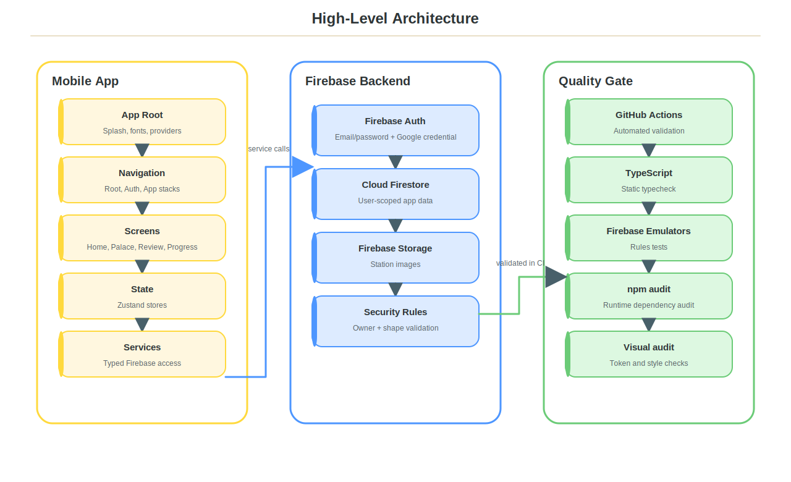
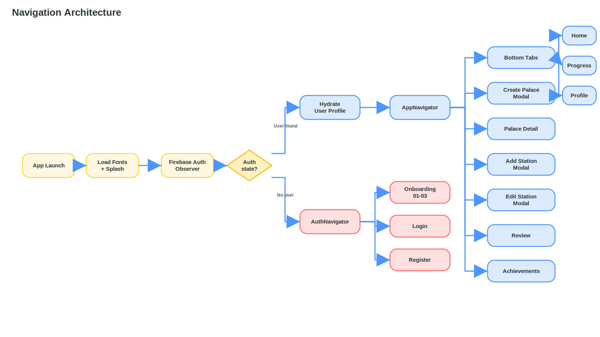
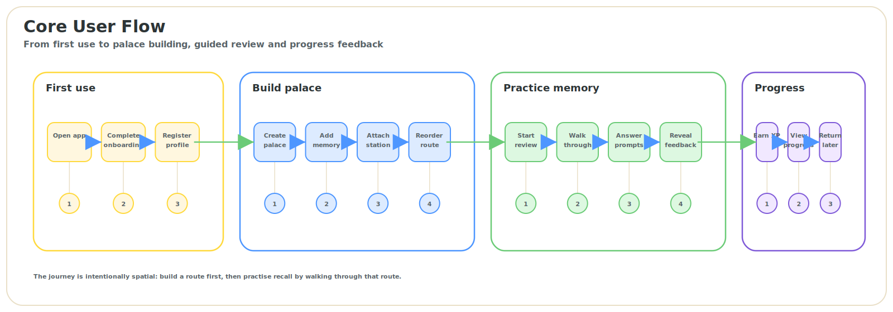
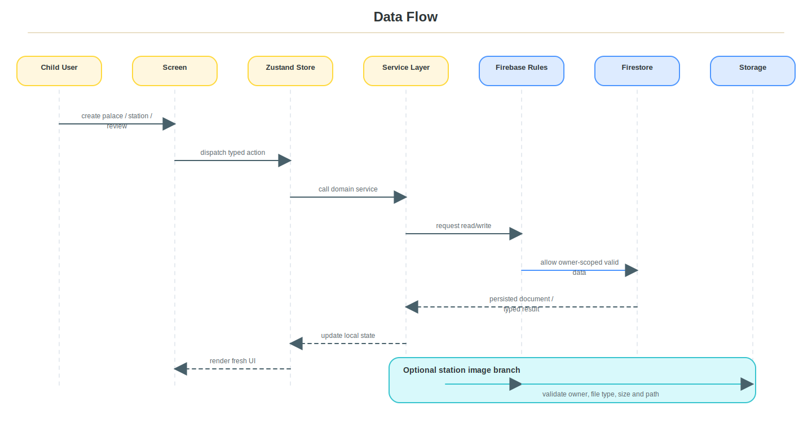
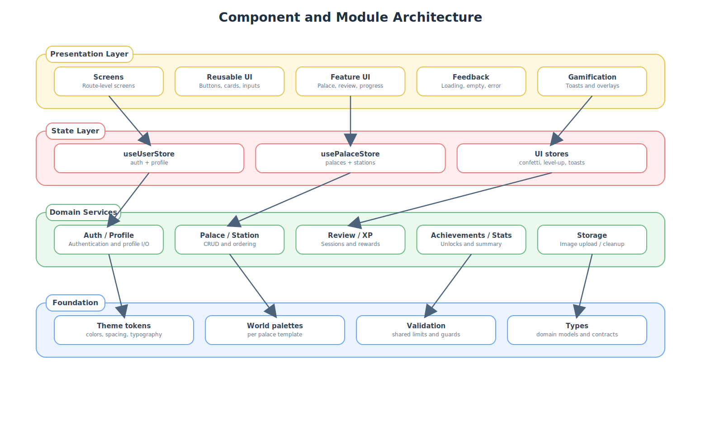
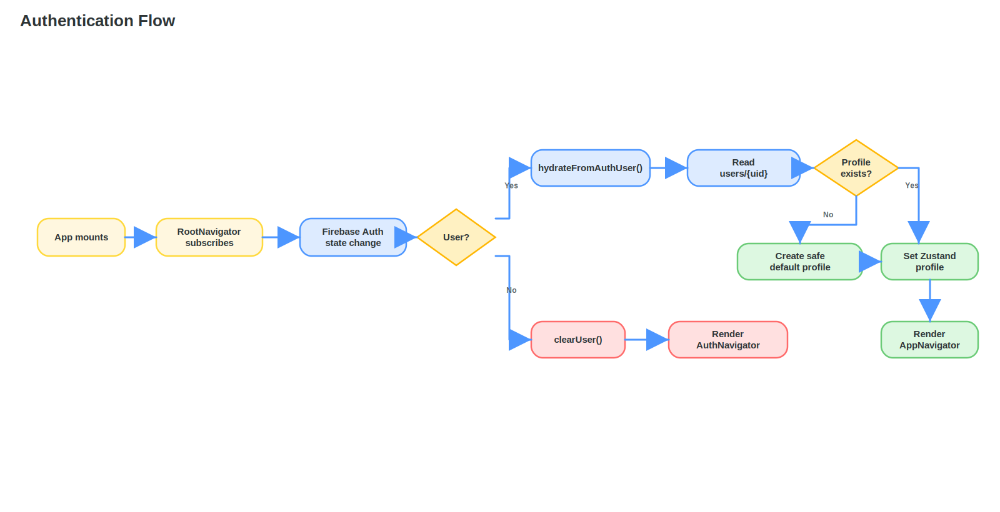
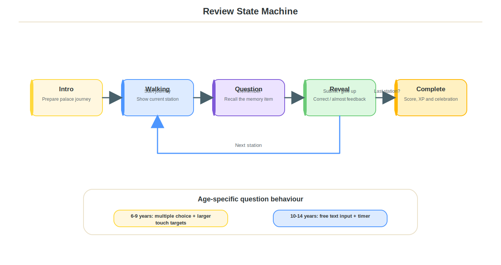
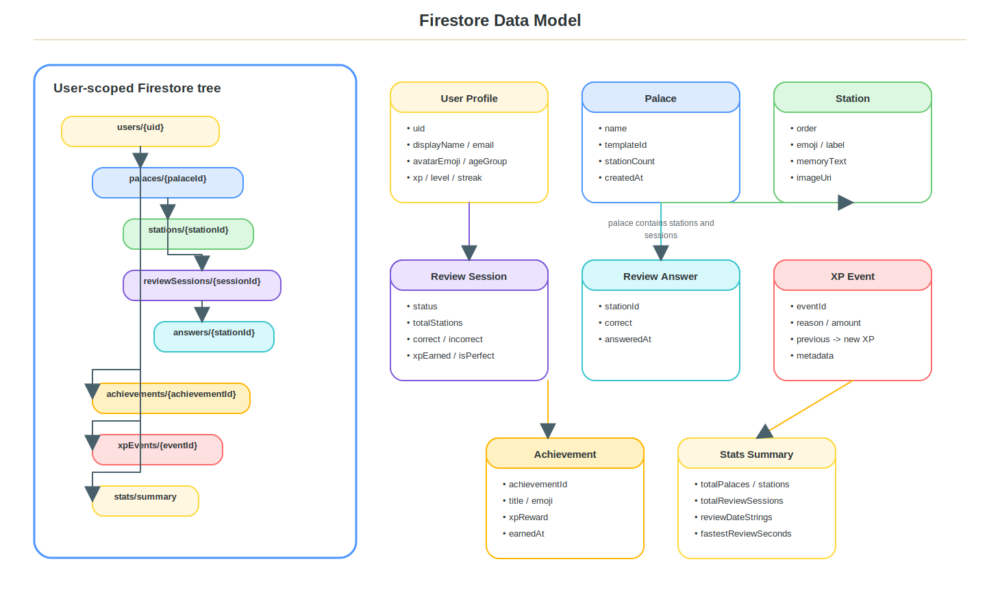
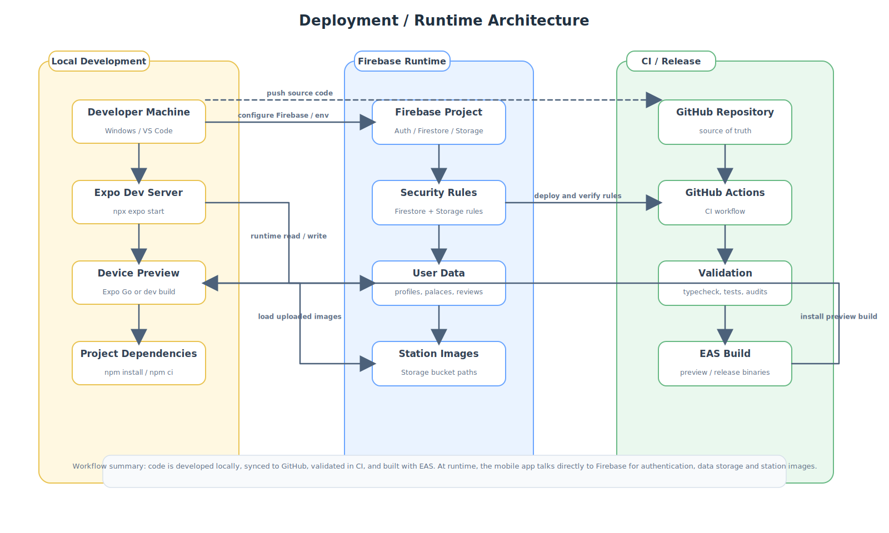

<div align="center">

# 🏛️ LociLand

### A playful Memory Palace Builder for children aged 6–14

**LociLand** is a cross-platform mobile application that turns the Method of Loci into an interactive, visual and gamified learning experience. Children create memory palaces, add ordered stations, attach information or images to each stop, and then walk through their palace to practise recall.

<br />


<br />

> **Portfolio focus:** mobile product design, React Native architecture, Firebase security rules, gamification, child-friendly UX, visual systems and memory-based learning workflows.

<br />

<!-- Replace this placeholder once app screenshots are available. -->


**Screenshot placeholder:** `docs/screenshots/hero-showcase.png`  
Capture a polished 3-device mockup showing Home, Palace Detail and Review Complete. This should be the main visual proof that the app feels like a real mobile product, not only a functional university prototype.

</div>

---

## Table of Contents

- [Overview](#overview)
- [Key Features](#key-features)
- [Visual Showcase](#visual-showcase)
- [App Screens and User Experience](#app-screens-and-user-experience)
- [Architecture](#architecture)
- [Tech Stack](#tech-stack)
- [Project Structure](#project-structure)
- [Core Workflows](#core-workflows)
- [Data Model](#data-model)
- [Design System and Visual Identity](#design-system-and-visual-identity)
- [Installation](#installation)
- [Environment Variables](#environment-variables)
- [Scripts](#scripts)
- [Testing and Quality](#testing-and-quality)
- [Deployment](#deployment)
- [Security Notes](#security-notes)
- [Roadmap](#roadmap)
- [What I Learned](#what-i-learned)
- [Author](#author)
- [License](#license)

---

## Overview

**LociLand** is an educational mobile app built around the **Memory Palace** technique, also known as the **Method of Loci**. The app helps children transform abstract information into spatial memory journeys.

Instead of presenting memory practice as a flat list of flashcards, LociLand structures learning around:

- **Palaces** as visual worlds.
- **Stations** as memory anchors.
- **Ordered paths** as the memory route.
- **Guided review** as a walk through the palace.
- **Progress, XP and achievements** as motivational feedback.

The project is designed for children aged **6–14**, with interface differentiation for younger and older users. Younger users receive larger touch targets, simplified review interactions and star-based progress. Older users receive more detailed metrics, free-text review and numeric XP/level feedback.

Technically, the application is a Firebase-backed React Native/Expo project with:

- Firebase Authentication.
- Firestore user-scoped data.
- Firebase Storage for station images.
- Zustand state management.
- Typed service-layer data operations.
- Firestore and Storage security rules.
- Emulator-based rules testing.
- CI validation with typecheck, rules tests, runtime audit and visual audit.

---

## Key Features

### Memory Palace Creation

Users can create personalized memory palaces from a set of themed templates:

| Template | Emoji | Experience |
| --- | --- | --- |
| My Home | 🏠 | Familiar and safe memory environment. |
| Magic Castle | 🏰 | Fantasy-based palace for playful learning. |
| Enchanted Forest | 🌲 | Calm exploratory journey. |
| Space Station | 🚀 | Futuristic and curiosity-driven setting. |
| Underwater World | 🐠 | Soft, calm and visually distinctive world. |
| Dinosaur Island | 🦕 | Adventure-oriented, energetic theme. |

Each template has its own visual world palette, helping the app communicate that different palaces are different spatial environments.

### Station System

A palace contains ordered memory stations. Each station can include:

- Emoji anchor.
- Short station name.
- Memory text.
- Optional image uploaded to Firebase Storage.
- Reorderable position in the palace route.

The order of stations is pedagogically important: it represents the mental walk through the palace.

### Guided Review Mode

The review flow is the core learning loop. It follows a state machine:

1. **Intro** — prepares the child for the journey.
2. **Walking** — shows the current station/location.
3. **Question** — asks the child to recall what was placed there.
4. **Reveal** — provides positive or encouraging feedback.
5. **Complete** — summarizes performance and rewards progress.

The review mode uses haptics, sound effects, animations, confetti and age-specific interaction modes.

### Age Group Adaptation

| Age Group | UX Strategy |
| --- | --- |
| 6–9 years | Larger fonts, larger touch targets, multiple-choice review, more emoji anchors, simplified star-based progress. |
| 10–14 years | Numeric XP and level details, free-text input, review timer, richer statistics. |

### Gamification

LociLand includes a full motivational layer:

- XP rewards.
- Level progression.
- Streak tracking.
- Achievement unlocks.
- Level-up overlay.
- Achievement toast.
- Progress dashboard.
- Daily local reminder logic.

### Cloud Sync

Firebase acts as the backend layer:

- Auth state is observed globally.
- User profiles are stored in Firestore.
- Palaces, stations, review sessions, answers, achievements, XP events and stats are scoped under each user.
- Station images are stored in Firebase Storage under user-specific paths.

---

## Visual Showcase

Real screenshots should be added to `docs/screenshots/`. The README is prepared with precise placeholders so the final repository can look professional once captures are exported from a real device.

### 1. Hero Showcase

**Recommended file:** `docs/screenshots/hero-showcase.png`

**Markdown:**

```md

```

**Capture instructions:**  
Create a 3-device mockup showing: Home with palaces, Palace Detail with station path, and Review Complete with celebration.

**Why it matters:**  
This gives recruiters and evaluators an immediate visual understanding of the product quality.

---

### 2. Onboarding Flow

**Recommended file:** `docs/screenshots/onboarding-flow.png`

```md

```

**Capture instructions:**  
Capture the onboarding screens showing the child-friendly introduction, guide character and first call-to-action.

**Why it matters:**  
The onboarding is the first impression and explains the app concept before the user enters the main experience.

---

### 3. Authentication Screens

**Recommended file:** `docs/screenshots/auth-register.png`

```md

```

**Capture instructions:**  
Capture the registration screen with avatar selector, age group selector, email/password fields and primary action.

**Why it matters:**  
This proves that the app has a real user model and not only local prototype data.

---

### 4. Home Screen With Palaces

**Recommended file:** `docs/screenshots/home-palaces.png`

```md

```

**Capture instructions:**  
Capture Home after creating at least three different palaces. The screenshot should show the greeting, avatar, palace cards, station count badges and floating create button.

**Why it matters:**  
Home is the central product surface and best communicates the app's playful world-based identity.

---

### 5. Empty Home State

**Recommended file:** `docs/screenshots/home-empty-state.png`

```md

```

**Capture instructions:**  
Use a fresh account with no palaces. Capture the empty state with the guide character and “Start building” CTA.

**Why it matters:**  
Empty states are important in product design. This one should feel inviting rather than unfinished.

---

### 6. Create Palace Screen

**Recommended file:** `docs/screenshots/create-palace.png`

```md

```

**Capture instructions:**  
Capture the create flow with a typed palace name, one selected template and the preview card visible.

**Why it matters:**  
This screen demonstrates multi-step mobile form design, template selection and visual preview.

---

### 7. Palace Detail and Memory Path

**Recommended file:** `docs/screenshots/palace-detail-path.png`

```md

```

**Capture instructions:**  
Open a palace with at least five stations. Capture the palace header, station route/path visualization, station cards and “Start Review” entry point.

**Why it matters:**  
This is where the Method of Loci becomes spatial. The screenshot should prove that memory is represented as a route, not only a list.

---

### 8. Add Station With Image

**Recommended file:** `docs/screenshots/add-station-image.png`

```md

```

**Capture instructions:**  
Capture the Add Station screen after selecting an emoji, writing a label, adding memory text and attaching an image.

**Why it matters:**  
This shows the core content-creation mechanic and Firebase Storage-backed image support.

---

### 9. Review Intro

**Recommended file:** `docs/screenshots/review-intro.png`

```md

```

**Capture instructions:**  
Start a review session and capture the intro state showing palace identity, station count and “Start the Journey” CTA.

**Why it matters:**  
It frames review as a guided walk, not a test.

---

### 10. Review Walking State

**Recommended file:** `docs/screenshots/review-walking.png`

```md

```

**Capture instructions:**  
Capture the walking state with progress bar, current station emoji/name, route preview and guide character.

**Why it matters:**  
This is the strongest visual translation of the Method of Loci into the UI.

---

### 11. Review Question — Younger User

**Recommended file:** `docs/screenshots/review-question-younger.png`

```md

```

**Capture instructions:**  
Use a profile with age group `6-9`. Capture the multiple-choice answer state with large touch targets.

**Why it matters:**  
It demonstrates age-specific UX and child-safe interaction design.

---

### 12. Review Question — Older User

**Recommended file:** `docs/screenshots/review-question-older.png`

```md

```

**Capture instructions:**  
Use a profile with age group `10-14`. Capture free-text answer input and timer.

**Why it matters:**  
It proves the app does not treat all children the same and supports more advanced recall behaviour.

---

### 13. Review Reveal Feedback

**Recommended file:** `docs/screenshots/review-reveal-feedback.png`

```md

```

**Capture instructions:**  
Capture either a correct answer celebration or an incorrect answer reveal. For incorrect, show the encouraging feedback and correct answer.

**Why it matters:**  
Emotional design is critical in children's learning products. Wrong answers should feel safe and constructive.

---

### 14. Perfect Review Complete

**Recommended file:** `docs/screenshots/review-perfect-complete.png`

```md

```

**Capture instructions:**  
Complete a review with 100% correct answers. Capture the summary state showing score, celebration and perfect memory badge.

**Why it matters:**  
This is the strongest gamification and reward screenshot.

---

### 15. Progress — Younger User

**Recommended file:** `docs/screenshots/progress-younger.png`

```md

```

**Capture instructions:**  
Use age group `6-9`. Capture Memory Stars, weekly activity and simplified achievement/progress view.

**Why it matters:**  
This demonstrates simplified, age-appropriate analytics.

---

### 16. Progress — Older User

**Recommended file:** `docs/screenshots/progress-older.png`

```md

```

**Capture instructions:**  
Use age group `10-14`. Capture XP, level, progress bar, weekly constellation and stats grid.

**Why it matters:**  
This demonstrates richer progression and metric visibility.

---

### 17. Profile Screen

**Recommended file:** `docs/screenshots/profile-screen.png`

```md

```

**Capture instructions:**  
Capture avatar, display name, level/streak identity, stats and account actions.

**Why it matters:**  
The profile acts as the child's memory identity/passport.

---

### 18. Achievements Screen

**Recommended file:** `docs/screenshots/achievements-screen.png`

```md

```

**Capture instructions:**  
Capture a mix of earned and locked achievements. At least three earned achievements should be visible.

**Why it matters:**  
Achievements show long-term motivation and system depth.

---

## App Screens and User Experience

| Screen / Module | Purpose | Main User Actions | Visual Notes | Suggested Screenshot |
| --- | --- | --- | --- | --- |
| Onboarding | Introduce the memory palace concept. | Continue, skip, start account creation. | Friendly, guided, cartoon-like first impression. | `docs/screenshots/onboarding-flow.png` |
| Login | Authenticate returning users. | Email login, password reset, Google sign-in. | Clean auth UI aligned with the playful palette. | `docs/screenshots/auth-login.png` |
| Register | Create child profile. | Enter name/email/password, select age group, choose avatar. | Age group cards should feel like character selection. | `docs/screenshots/auth-register.png` |
| Home | Main palace dashboard. | View palaces, create palace, open palace, start review, delete palace. | Visual worlds as cards; clear empty/loading/error states. | `docs/screenshots/home-palaces.png` |
| Create Palace | Build a new memory world. | Enter name, select template, preview, create. | Modal-style flow with animated template selection. | `docs/screenshots/create-palace.png` |
| Palace Detail | Manage stations inside one palace. | Add/edit/delete/reorder stations, start review. | Should show spatial route/path, not only a list. | `docs/screenshots/palace-detail-path.png` |
| Add/Edit Station | Create memory anchors. | Select emoji, add label, add memory text, upload image. | Workshop-like creative screen. | `docs/screenshots/add-station-image.png` |
| Review | Core learning loop. | Walk through stations, answer, reveal, finish. | Cinematic guided journey with feedback and celebration. | `docs/screenshots/review-walking.png` |
| Progress | Show learning growth. | Refresh progress, inspect activity, level and achievements. | Younger: stars; older: XP, charts and detailed stats. | `docs/screenshots/progress-older.png` |
| Profile | Show user identity and settings. | View avatar/profile, log out, update account settings. | Child's memory identity/passport. | `docs/screenshots/profile-screen.png` |
| Achievements | Reward gallery. | Inspect earned/locked achievements. | Badge grid with visual reward states. | `docs/screenshots/achievements-screen.png` |

---

## Architecture

LociLand is a **frontend-heavy mobile application** backed by Firebase services. There is no custom Express/FastAPI backend in the repository; Firebase provides authentication, database, storage and security rules.

> Diagram format note: diagrams are stored as static SVG files under `docs/diagrams/` to keep a white background and stable rendering in GitHub, regardless of Mermaid or browser theme settings.

### High-Level Architecture

<p align="center">
  
</p>


### Navigation Architecture

<p align="center">
  
</p>


### User Flow

<p align="center">
  
</p>


### Data Flow

<p align="center">
  
</p>


### Component and Module Architecture

<p align="center">
  
</p>


### Authentication Flow

<p align="center">
  
</p>


### Review State Machine

<p align="center">
  
</p>


### Database / Entity Relationship Diagram

<p align="center">
  
</p>


### Deployment / Runtime Architecture

<p align="center">
  
</p>


---

## Tech Stack

| Layer | Technology | Purpose |
| --- | --- | --- |
| Mobile Framework | Expo SDK 54 | Managed React Native app runtime and tooling. |
| UI Runtime | React Native 0.81 | Native mobile interface. |
| Frontend Library | React 19 | Component-based UI model. |
| Language | TypeScript 5.9 | Static typing and maintainability. |
| Navigation | React Navigation v7 | Auth stack, app stack and bottom tabs. |
| State Management | Zustand 5 | Lightweight global state for user, palaces and UI events. |
| Authentication | Firebase Auth | Email/password and Google credential sign-in support. |
| Database | Cloud Firestore | User profiles, palaces, stations, reviews, achievements, XP events and stats. |
| File Storage | Firebase Storage | Station image uploads. |
| Animations | Reanimated, Lottie | Micro-interactions, guide animations and celebrations. |
| Media / Feedback | Expo AV, Haptics, Notifications | Review sounds, tactile feedback and local reminders. |
| Image Selection | Expo Image Picker | Station image selection from gallery. |
| Fonts | Fredoka One, Nunito | Playful headings and readable body text. |
| Testing | Vitest, Firebase Rules Unit Testing | Firestore and Storage rules validation. |
| CI | GitHub Actions | Typecheck, emulator tests, runtime audit and visual audit. |
| Styling Foundation | Theme tokens + NativeWind config | Centralized colors, typography, spacing, motion and world palettes. |

---

## Project Structure

| Path | Purpose |
| --- | --- |
| `App.tsx` | App root, font loading, splash handling, navigation container and safe area provider. |
| `app.json` | Expo app configuration, icons, splash screen, bundle identifiers and plugins. |
| `src/navigation/` | Root/Auth/App navigation, route typing and screen structure. |
| `src/screens/onboarding/` | First-use onboarding flow. |
| `src/screens/auth/` | Login and registration screens. |
| `src/screens/app/` | Main product screens: Home, palace, station, review, progress, profile and achievements. |
| `src/components/ui/` | Reusable UI primitives such as buttons, cards, input and typography. |
| `src/components/gamification/` | Level-up, streak, confetti and achievement feedback components. |
| `src/components/progress/` | Visual progress cards and activity visualizations. |
| `src/components/palace/` | Palace cards, delete sheet and palace-specific UI. |
| `src/components/review/` | Review-specific visual/guide components. |
| `src/hooks/` | Reusable hooks, including age-group UI adaptation. |
| `src/store/` | Zustand stores for auth/profile, palaces, confetti, level-up and achievement toast state. |
| `src/services/` | Firebase-facing business logic and domain services. |
| `src/constants/validation.ts` | Central client-side validation limits aligned with Firebase rules. |
| `src/theme/` | Design tokens: colors, typography, spacing, radius, shadows, world palettes and motion. |
| `src/types/` | Domain types for users, palaces, stations and reviews. |
| `src/utils/` | Level logic, age group normalization and error handling helpers. |
| `firestore.rules` | Firestore authorization and schema validation rules. |
| `storage.rules` | Firebase Storage owner/path/type/size rules for station images. |
| `tests/rules/` | Firestore and Storage rules tests using Firebase Emulator. |
| `.github/workflows/ci.yml` | Continuous validation pipeline. |
| `docs/` | Visual design notes, visual QA checklist and project documentation. |

---

## Core Workflows

### Registration / Login Flow

1. User opens the app.
2. App loads fonts and keeps the splash screen until initial state is ready.
3. Root navigation subscribes to Firebase Auth state.
4. New users go through onboarding, login or registration.
5. Registration creates a Firebase Auth account and a Firestore user profile.
6. The user profile includes display name, email, avatar emoji, age group, XP, level and streak fields.
7. Once authenticated, the app hydrates Zustand state and renders the main app navigator.

### Palace Creation Flow

1. User opens `CreatePalaceScreen`.
2. User enters a palace name.
3. User selects one of six templates.
4. The app shows a preview palace card.
5. `palaceService.createPalace()` writes to `users/{uid}/palaces/{palaceId}`.
6. Stats are updated.
7. XP is granted through an idempotent XP event.
8. Achievements are checked.
9. The app opens `PalaceDetailScreen`.

### Station Creation Flow

1. User opens the add station modal from a palace.
2. User selects emoji, label, memory text and optional image.
3. If an image is selected, it is uploaded to Firebase Storage under the user/palace/station path.
4. `stationService.createStation()` creates the station and increments the parent palace station count in a transaction or fallback batch.
5. Stats, XP and achievements are updated.
6. Zustand updates the local station list.

### Review Flow

1. User starts a review from a palace with at least two stations.
2. `reviewService.startReview()` creates an active review session.
3. The Review screen enters the state machine: Intro → Walking → Question → Reveal → Complete.
4. Each answer is recorded by station ID in the session's `answers` subcollection.
5. Counters are updated transactionally.
6. `completeReview()` calculates XP, detects perfect reviews and marks the session as completed.
7. XP is applied through idempotent XP events.
8. Stats and achievements are updated.
9. The user sees a celebration or summary screen.

### Progress Flow

1. Progress screen calls `getProgressStats(userId)`.
2. The service reads the user profile, stats summary and recent achievements.
3. If stats look stale, the service can rebuild the summary from palaces, stations and review sessions.
4. The UI adapts based on age group:
   - Younger users see stars and simplified progress.
   - Older users see XP, levels, weekly activity and detailed metrics.

### Achievement Flow

1. Significant events trigger `checkAchievements()`.
2. The achievement service reads user stats and current profile state.
3. Unlockable achievements are detected from definitions in `src/assets/achievements.ts`.
4. Earned achievements are written to Firestore.
5. Achievement toast is displayed.
6. Current implementation treats `achievement` XP as non-mutating in `xpService`; achievement documents are still recorded.

---

## Data Model

### Firestore Layout

```txt
users/{uid}
  palaces/{palaceId}
    stations/{stationId}
    reviewSessions/{sessionId}
      answers/{stationId}
  achievements/{achievementId}
  xpEvents/{eventId}
  stats/summary
```

### Main Entities

| Entity | Description | Important Fields |
| --- | --- | --- |
| User Profile | Authenticated child profile. | `uid`, `displayName`, `email`, `avatarEmoji`, `ageGroup`, `xp`, `level`, `streak`, `bestStreak`. |
| Palace | A memory world owned by one user. | `name`, `templateId`, `stationCount`, `createdAt`. |
| Station | A stop inside a palace route. | `order`, `emoji`, `label`, `memoryText`, `imageUri`. |
| Review Session | One review attempt for a palace. | `status`, `totalStations`, `correctAnswers`, `incorrectAnswers`, `xpEarned`, `isPerfect`. |
| Review Answer | One answer for one station in one review session. | `stationId`, `correct`, `answeredAt`. |
| XP Event | Idempotency record for XP grants. | `eventId`, `reason`, `amount`, `previousXP`, `newXP`, `metadata`. |
| Achievement | Earned achievement record. | `achievementId`, `title`, `emoji`, `xpReward`, `earnedAt`. |
| Stats Summary | Aggregated progress document. | `totalPalaces`, `totalStations`, `totalReviewSessions`, `reviewDateStrings`, `fastestReviewSeconds`. |

### Validation and Constraints

Important validation rules are centralized in `src/constants/validation.ts` and mirrored by Firebase rules where needed.

| Area | Constraint |
| --- | --- |
| Password | Minimum 6 characters. |
| Display name | Max 40 characters. |
| Palace name | Required, max 40 characters. |
| Palace station count | 0–20. |
| Station order | 0–20. |
| Station label | Required, max 40 characters. |
| Station memory text | Max 500 characters. |
| Station image | Firebase Storage URL, max 2 MB, JPEG/PNG/WebP. |
| Review | Minimum 2 stations, maximum 20 stations. |
| XP | User profile XP capped at 100,000 in rules. |
| Streak | Streak capped at 3,650 days in rules. |

---

## Design System and Visual Identity

LociLand's design direction is intentionally child-friendly but not careless. The goal is to feel like a polished educational product: playful, soft, readable and visually coherent.

### Core Visual Concept

The app maps memory concepts to visual structures:

| Memory Concept | UI Representation |
| --- | --- |
| Palace | A themed world. |
| Station | A memory anchor/node. |
| Order | A path or journey. |
| Review | A guided walk. |
| XP | Memory energy. |
| Progress | Growth, stars and constellation-like activity. |

### Color Palette

Core colors are centralized in `src/theme/colors.ts`:

| Token | Value | Role |
| --- | --- | --- |
| `primary` | `#FFD93D` | Warm yellow primary accent. |
| `secondary` | `#6BCB77` | Green success/growth color. |
| `accent` | `#4D96FF` | Blue interactive accent. |
| `emphasis` | `#FF6B6B` | Red/coral attention and danger. |
| `bg` | `#FFFBF0` | Warm off-white app background. |
| `text` | `#2D3436` | Primary readable dark text. |

### World Palettes

Each palace template has a separate palette in `src/theme/worlds.ts`. This is important: the worlds are not just labels; they have dedicated background, surface, path, node and accent colors.

| World | Visual Mood |
| --- | --- |
| My Home | Warm, safe and familiar. |
| Magic Castle | Fantasy, discovery and magic. |
| Enchanted Forest | Calm exploration. |
| Space Station | Focus, curiosity and futuristic memory. |
| Underwater World | Smooth, soft and calm. |
| Dinosaur Island | Adventure, warmth and energy. |

### Typography

| Font | Role |
| --- | --- |
| Fredoka One | Headings, large labels and playful display text. |
| Nunito | Body, labels, buttons and readable UI text. |

### Motion

Motion is defined as a product layer rather than random animation. Tokens in `src/theme/motion.ts` group durations into instant, fast, normal, slow, cinematic and celebration timings.

Motion is used for:

- Button press feedback.
- Card entrance and selection.
- Review transitions.
- Correct/incorrect answer feedback.
- Confetti and celebration moments.
- Level-up and achievement overlays.

### Accessibility and Child UX Notes

The visual QA documentation defines acceptance checks for:

- Safe area handling.
- Minimum touch targets.
- Card spacing.
- Contrast and readability.
- Small phone layouts.
- Age-group differentiation.
- Motion discipline.

---

## Installation

### Prerequisites

- Node.js 20+ recommended.
- npm.
- Expo CLI / Expo tooling.
- Firebase project with Auth, Firestore and Storage enabled.
- Java 21+ for Firebase Emulator tests.
- Android Studio or physical Android device recommended.
- macOS + Xcode only if building iOS locally.

### 1. Clone the repository

```bash
git clone https://github.com/angelperezcastro/LociLandApp.git
cd LociLandApp
```

### 2. Install dependencies

```bash
npm install
```

For CI-like clean installs:

```bash
npm ci
```

### 3. Configure environment variables

Create a `.env` file in the project root.

```bash
cp .env.example .env
```

> Note: `.env.example` was not detected in the repository at the time of analysis. Create it manually using the table below.

### 4. Start the app

```bash
npm start
```

Then open the app using:

```bash
npm run android
```

or:

```bash
npm run ios
```

or scan the Expo QR code with Expo Go where supported.

### 5. Run validation

```bash
npm run validate
```

This runs:

1. TypeScript check.
2. Firebase rules tests.
3. High-severity runtime dependency audit.
4. Visual audit script.

---

## Environment Variables

The app reads Firebase config from public Expo variables. These values are required for the client app to connect to the correct Firebase project.

> Firebase web/mobile config values are not database passwords, but they still identify the project. They must be paired with strict Firestore and Storage rules.

| Variable | Required | Description | Example Value |
| --- | --- | --- | --- |
| `EXPO_PUBLIC_FIREBASE_API_KEY` | Yes | Firebase web API key. | `AIzaSyD-example-key` |
| `EXPO_PUBLIC_FIREBASE_AUTH_DOMAIN` | Yes | Firebase Auth domain. | `lociland-demo.firebaseapp.com` |
| `EXPO_PUBLIC_FIREBASE_PROJECT_ID` | Yes | Firebase project ID. | `lociland-demo` |
| `EXPO_PUBLIC_FIREBASE_STORAGE_BUCKET` | Yes | Firebase Storage bucket. | `lociland-demo.appspot.com` |
| `EXPO_PUBLIC_FIREBASE_MESSAGING_SENDER_ID` | Yes | Firebase messaging sender ID. | `123456789012` |
| `EXPO_PUBLIC_FIREBASE_APP_ID` | Yes | Firebase app ID. | `1:123456789012:web:abcdef123456` |

Recommended `.env.example`:

```env
EXPO_PUBLIC_FIREBASE_API_KEY=your_firebase_api_key
EXPO_PUBLIC_FIREBASE_AUTH_DOMAIN=your_project.firebaseapp.com
EXPO_PUBLIC_FIREBASE_PROJECT_ID=your_project_id
EXPO_PUBLIC_FIREBASE_STORAGE_BUCKET=your_project.appspot.com
EXPO_PUBLIC_FIREBASE_MESSAGING_SENDER_ID=your_sender_id
EXPO_PUBLIC_FIREBASE_APP_ID=your_app_id
```

---

## Scripts

| Script | Command | Purpose |
| --- | --- | --- |
| `start` | `expo start` | Start Expo development server. |
| `android` | `expo start --android` | Start app on Android. |
| `ios` | `expo start --ios` | Start app on iOS. |
| `web` | `expo start --web` | Start web target. |
| `typecheck` | `tsc --noEmit` | Run TypeScript validation without emitting files. |
| `test` | `npm run test:rules` | Run Firebase rules tests. |
| `test:rules` | `firebase emulators:exec --only firestore,storage "vitest run --config vitest.config.mjs"` | Execute Firestore and Storage rules tests through emulators. |
| `test:rules:watch` | `firebase emulators:exec --only firestore,storage "vitest --config vitest.config.mjs"` | Watch mode for rules tests. |
| `audit` | `npm audit --omit=dev --audit-level=moderate` | Runtime dependency audit with moderate threshold. |
| `audit:runtime` | `npm audit --omit=dev --audit-level=high` | Runtime dependency audit with high threshold. |
| `audit:deps` | `npm audit --audit-level=high` | Full dependency audit with high threshold. |
| `audit:visual` | `node scripts/visual-audit.js` | Custom visual consistency audit. |
| `validate` | `npm run typecheck && npm test && npm run audit:runtime && npm run audit:visual` | Main local quality gate. |

---

## Testing and Quality

### Existing Quality Gates

The project includes:

- TypeScript strict checking through `tsc --noEmit`.
- Firebase Emulator rules tests through Vitest.
- Firestore security rules tests.
- Storage security rules tests.
- Runtime dependency audit.
- Custom visual audit script.
- GitHub Actions CI.

### Firestore Rules Tests

The Firestore test suite validates scenarios such as:

- Users can create their own valid profile.
- Cross-user reads are denied.
- Direct XP, level and streak manipulation is denied.
- Safe profile fields can be edited.
- Valid palace creation succeeds.
- Invalid palace data fails.
- Valid station data succeeds.
- Invalid station data fails.
- Review sessions and answer updates follow expected constraints.
- Aggregated stats are user-scoped.

### Storage Rules Tests

The Storage test suite validates:

- Owners can upload valid station images.
- Uploads to another user's path are denied.
- Unsupported image types are denied.
- Files above 2 MB are denied.
- Invalid file names are denied.

### CI Pipeline

GitHub Actions runs on pushes and pull requests. The validation job:

1. Checks out the repository.
2. Sets up Node.js 20.
3. Sets up Java 21 for Firebase emulators.
4. Installs dependencies with `npm ci`.
5. Runs TypeScript check.
6. Runs Firebase rules tests.
7. Runs runtime audit.
8. Runs visual audit.

### Current Testing Limitations

- Existing automated tests focus mainly on Firebase rules.
- UI component tests are not yet present.
- End-to-end tests are not yet present.
- Service-level tests beyond rules are a recommended next step.
- Manual testing on physical devices remains essential because this is a child-facing mobile UI.

---

## Deployment

### Firebase Rules Deployment

`firebase.json` includes both Firestore and Storage rules configuration.

Deploy rules with:

```bash
firebase deploy --only firestore:rules,storage
```

### Expo Development

Use Expo for local development:

```bash
npm start
```

### Android Preview Build

Recommended preview build flow:

```bash
eas build --platform android --profile preview
```

### iOS Build

To be confirmed depending on Apple Developer setup and EAS profile configuration.

```bash
eas build --platform ios --profile preview
```

### Production Considerations

Before treating this as production-ready for real children, review:

- Firebase rules under real project conditions.
- Google sign-in configuration for Android/iOS bundle IDs.
- Push notification behaviour outside Expo Go.
- Storage cleanup after station/palace deletion.
- Privacy documentation and parental consent requirements if real child data is collected.
- Crash reporting and production logging.

---

## Security Notes

This is not a backend API project. Security is mainly enforced through Firebase Authentication, Firestore rules and Storage rules.

### Applied Security Practices

- Firebase Auth handles user identity.
- Firestore documents are scoped under `users/{uid}`.
- Firestore rules restrict cross-user access.
- Profile updates restrict sensitive calculated fields such as XP, level and streak.
- Palaces, stations, reviews, XP events and stats have schema validation rules.
- XP grants use event IDs for idempotency.
- Review answer recording uses Firestore transactions.
- Storage uploads are user-scoped.
- Storage rules validate file type, file size and filename format.
- `.env` and credentials folders are ignored by Git.
- CI runs rules tests and audits.

### Important Security Limitations

- Firebase client config values are public by design; security must rely on rules, not obscurity.
- XP, achievements and review logic still run from the client service layer. Rules mitigate manipulation, but a production-grade system would move sensitive reward logic to Cloud Functions.
- No `SECURITY.md` file was detected. Adding one would improve repository professionalism.
- No `LICENSE` file was detected. Add one before presenting the project as open source.
- If the project ever stores real data from minors, legal/privacy requirements must be reviewed separately.

---

## Roadmap

### Product and UX

- Add real screenshots and device mockups to `docs/screenshots/`.
- Add a short demo video or GIF of the core flow.
- Improve accessibility labels and screen reader support across all interactive elements.
- Add reduced-motion support for decorative animations.
- Add localization support if the app is intended for Spanish-speaking users.
- Add parent/teacher explanation screens for the Method of Loci.

### Technical

- Add `.env.example` to the repository.
- Add `SECURITY.md`.
- Add a `LICENSE` file.
- Add service-level tests for XP, review completion, palace deletion and station image cleanup.
- Add E2E smoke tests for the core flow.
- Consider Cloud Functions for XP, achievements, streaks and deep deletion.
- Add crash reporting and production-safe logging.
- Add typed Firebase converter helpers for stronger data mapping.

### Performance

- Add pagination or lazy loading for very large palace/station histories.
- Continue using aggregated stats for progress screens.
- Monitor Storage cleanup and orphaned file behaviour.
- Profile Review screen animations on lower-end Android devices.

### Visual Polish

- Finalize icon, adaptive icon and splash branding.
- Replace any remaining raw hardcoded visual values with theme tokens where practical.
- Add final screenshot deck for academic evaluation and portfolio usage.
- Keep the visual audit in CI as a guardrail against design drift.

---

## What I Learned

This project demonstrates several technical and product lessons:

- How to translate an abstract cognitive technique into a concrete mobile interaction model.
- How to design a child-friendly app that remains structured and technically maintainable.
- How to separate navigation, service logic, global state and reusable UI components in React Native.
- How to use Firebase as a backend while treating security rules as a real authorization layer.
- How to design idempotent XP events and avoid obvious duplicate reward bugs.
- How to combine gamification with learning without making wrong answers feel punitive.
- How to build visual systems around tokens, world palettes and motion principles.
- How to make a university project more defensible as a portfolio-grade product.

---

## Author

| Field | Value |
| --- | --- |
| Name | Ángel Pérez Castro |
| GitHub | [angelperezcastro](https://github.com/angelperezcastro) |
| LinkedIn | To be added |
| Portfolio | To be added |
| Email | To be added |

---

## License

No license file was detected in the repository at the time this README was generated.

Recommended next step: add a `LICENSE` file. For portfolio/university projects, common options are:

- **MIT License** if the project can be reused freely.
- **All rights reserved** notice if the code should not be reused.
- University-specific license if required by the academic context.

---

<div align="center">

**LociLand** — turning memory into a place children can explore.

</div>
